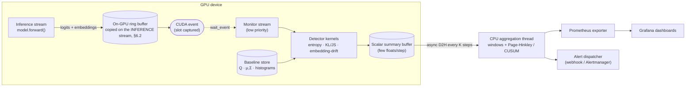
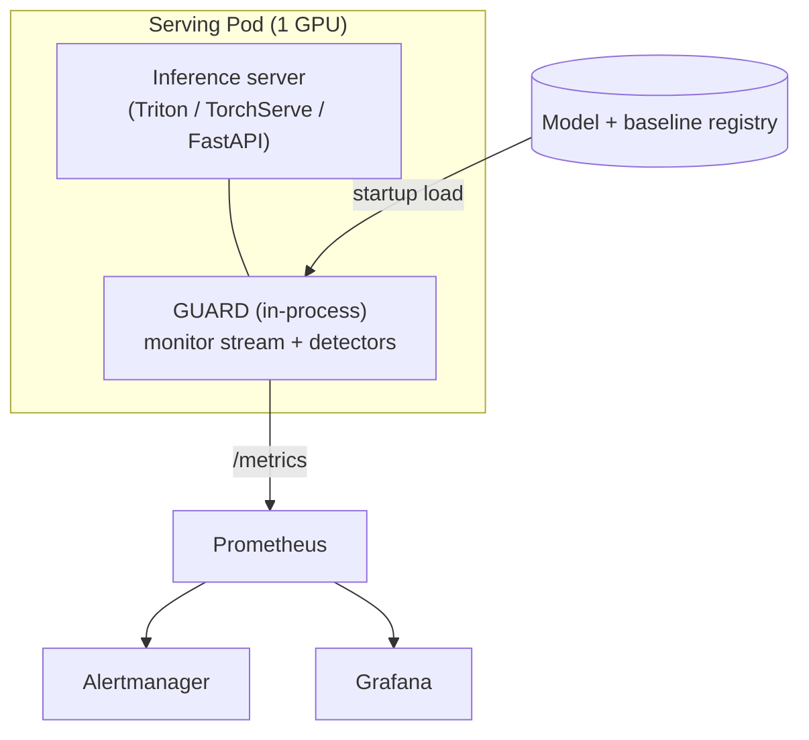

# GUARD — GPU-Native Unsupervised Anomaly & Runtime Drift Monitor

**Status:** Design / Architecture v1 · **Target:** Production deployment · **Year:** 2026

---

## 1. Overview

GUARD is an in-process observability layer for ML inference servers. It computes
distributional and anomaly signals **on the GPU, concurrently with inference**, so that
a serving model is continuously watched for output drift, distribution shift, and
per-sample anomalies without measurably slowing the inference path.

The central engineering idea is simple to state and subtle to get right: inference runs
on one CUDA stream, monitoring runs on a **separate, lower-priority CUDA stream**, and the
GPU scheduler interleaves the (tiny) monitoring kernels into the gaps left by the (large)
inference kernels. Because the detector math — Shannon entropy, KL/JS divergence,
embedding-drift distances — is cheap relative to a transformer forward pass, and because
no output ever leaves the GPU on the hot path, the wall-clock cost is designed to be in
the low-single-digit-percent range (often near-zero) rather than the 10–40% you typically
pay for naive "copy-to-CPU-and-compute" monitoring.

GUARD is **unsupervised**: it needs no labels at runtime. It compares live behavior to a
**baseline** captured offline from known-good data, and flags statistically significant
departures.

---

## 2. Problem statement & motivation

Models in production silently degrade. The three failure modes GUARD targets:

| Failure mode | What happens | What GUARD measures |
|---|---|---|
| **Covariate / input shift** | Input feature distribution changes; model still emits confident-looking outputs | Embedding-space drift (Mahalanobis / MMD) |
| **Prior / label shift** | The mix of predicted classes shifts away from baseline | KL / JS divergence on output distribution |
| **Confidence collapse / anomalies** | Individual predictions become uncertain or out-of-distribution | Per-sample entropy + embedding distance |

The usual options are bad:

- **CPU-side monitoring** copies logits/embeddings to host, serializes, and computes
  metrics off the critical path of throughput — adds latency and host memory pressure.
- **Sampling** (monitor 1% of traffic) misses rare anomalies, which are exactly the point.
- **Offline batch monitoring** (nightly jobs over logged data) detects drift hours late and
  requires storing every output.

GUARD computes **on every output, in real time, on the device the data already lives on.**

---

## 3. Design goals & non-goals

**Goals**

1. **Near-zero inference overhead** — p99 latency increase target **< 2%** under realistic load; verifiable with Nsight Systems showing kernel overlap.
2. **GPU-resident hot path** — no device→host transfer per request; only small scalar summaries (a few floats) leave the GPU, batched every *K* steps.
3. **Unsupervised, baseline-relative** — no runtime labels.
4. **Fail-safe** — monitoring can never crash, stall, or corrupt inference. It is best-effort observability, not a hard dependency.
5. **Framework-native** — attach to an existing PyTorch model via hooks/wrapper with no model surgery.
6. **Production observability** — first-class Prometheus/OpenTelemetry export, Grafana dashboards, Alertmanager integration.

**Non-goals (v1)**

- Not a root-cause/explainability tool — it *detects* drift, it doesn't diagnose *why*.
- Not an auto-remediation system (no automatic model rollback). It emits signals; a human/policy decides.
- Not a labeled-accuracy monitor — it can't tell you true accuracy without ground truth; it tells you *behavioral change*.
- Not multi-framework in v1 (PyTorch first; TF/JAX adapters are future work).

---

## 4. Key concepts & glossary

- **Baseline / reference:** statistics computed offline from a representative known-good dataset (class distribution `Q`, entropy histogram, embedding mean `μ_ref` and covariance `Σ_ref`). Versioned with the model.
- **Window:** a sliding/tumbling set of recent outputs over which population statistics are computed.
- **Detector:** a function from outputs/embeddings → scalar score (entropy, KL, drift distance).
- **Change-point test:** an online test (Page-Hinkley, CUSUM, ADWIN) over a *scalar metric stream* that decides when a change is statistically significant vs. noise.
- **Monitor stream:** dedicated low-priority CUDA stream that runs detector kernels.
- **Ring buffer:** pre-allocated on-GPU circular buffer holding recent captured tensors so detector kernels have stable memory to read.

---

## 5. System architecture



**Layered responsibilities**

| Layer | Runs on | Job | Cost |
|---|---|---|---|
| **Integration** | CPU (Python) | Tap model outputs/embeddings via hooks or wrapper | negligible |
| **Capture** | GPU (inference stream) | Copy outputs into GUARD's ring buffer (§6.2) | two small D2D copies |
| **Detectors** | GPU (monitor stream) | Entropy / KL / embedding-drift kernels | small, overlapped |
| **Temporal logic** | CPU (background thread) | Windowing + change-point tests over scalar streams | trivial |
| **Baseline mgmt** | CPU + GPU | Load/version reference stats; re-baseline workflow | offline |
| **Export/alert** | CPU (background thread) | Prometheus, OTel, webhooks | off critical path |
| **Control plane** | CPU | Config, health, enable/disable, threshold tuning | offline |

The split is deliberate: **heavy per-sample math on GPU, tiny per-window temporal logic on CPU.** A change-point test operates on one number per window, so it costs nothing and stays off the device.

---

## 6. The overlap engine (the technical heart)

This is where "near-zero overhead" is won or lost. Three things must be true:

1. The monitor stream **must not start** until inference has produced the outputs.
2. The monitor stream **must not block** the inference stream.
3. The output tensors GUARD reads **must not be freed or overwritten** by the next inference iteration before GUARD has captured them — including when they live in a static buffer the allocator never sees (§6.2).

### 6.1 Streams, events, and ordering

- Inference runs on its stream (default stream, or an explicit high-priority one if you control the server loop).
- A `torch.cuda.Event` is recorded on the inference stream immediately after `forward()`. It marks "outputs are ready."
- The monitor stream issues `wait_event(done)`, so its kernels are *enqueued* immediately (the CPU never blocks) but *execute* only after inference completes — purely a GPU-side dependency.
- The monitor stream is created at **low priority** so the scheduler always prefers inference kernels; monitoring fills idle SM capacity (e.g., during memory-bound layers and inter-layer gaps). In PyTorch, lower priority number = higher priority; create the monitor stream with the default/low priority and, if you own the loop, elevate inference with `priority=-1`.

### 6.2 Memory safety: capture on the inference stream

The dangerous bug: the outputs `forward()` returned are overwritten before the monitor has
finished reading them, and the result is not a crash but *silently wrong metrics* — entropy
and divergence computed on a torn mix of two batches, exported as if they were real.

There are two distinct ways that memory gets reused, and this design originally addressed
only the first.

**Allocator recycling.** PyTorch's caching allocator tracks which stream "owns" a tensor's
memory and may hand that block back for reuse once the *owning* stream is done — even if
another stream still has a queued read. `tensor.record_stream(monitor_stream)` is the
documented fix: it tells the allocator to defer reuse until the monitor's work completes.

**In-place rewriting of memory that is never freed.** This is the case `record_stream`
cannot touch, and it is increasingly the common one. CUDA-graph replay,
`torch.compile(mode="reduce-overhead")`, TensorRT output bindings and any pre-allocated
`out=` buffer write their results into the *same device addresses* on every iteration. The
allocator is never involved, so there is nothing for `record_stream` to defer. If the ring
copy were queued on the monitor stream, iteration N+1 would overwrite the buffer while the
copy of iteration N was still sitting behind a backlog of detector kernels — and because
the monitor stream is deliberately low priority, being behind is its normal state.

So **the capture runs on the inference stream**, not the monitor stream:

- The copy into the pre-allocated ring buffer is issued in the caller's stream, immediately
  after `forward()`. Stream ordering then guarantees it against both the kernels that
  produced the tensors and whatever overwrites them next — for allocator memory, graph
  pools, and external bindings alike. `record_stream` becomes unnecessary.
- The mirror-image hazard is slot reuse: inference must not overwrite ring slot *s* while
  the monitor is still reading it from `ring_slots` steps ago. The inference stream waits on
  that slot's completion event first. At the default depth of 8 that event completed long
  ago, so the wait costs nothing; when it does not, `guard_ring_utilization` is the metric
  that says so and `ring_slots` is the knob.
- Detectors read only the ring, which GUARD owns for the process lifetime, so their work is
  fully decoupled from the inference tensors' lifecycle.

**The cost, stated honestly.** Inference now pays two device-to-device copies per step —
about 450 KB at B=64, C=1000, D=768, single-digit microseconds — instead of zero. That is
the price of correctness across every kind of output memory, and it is inside the <2%
budget for any model whose forward pass is measured in milliseconds. It is *not* free, and
§14's benchmark measures it rather than assuming it away.

### 6.3 Skeleton

```python
import torch

class GuardMonitor:
    def __init__(self, batch, num_classes, embed_dim,
                 ring_size=256, device="cuda"):
        # Low-priority monitor stream: never preempts inference.
        self.monitor_stream = torch.cuda.Stream(device=device)  # default/low priority
        self.ring_logits = torch.empty((ring_size, batch, num_classes), device=device)
        self.ring_embed  = torch.empty((ring_size, batch, embed_dim),  device=device)
        self.ring_size = ring_size
        self.slot = 0
        # Each detector owns a contiguous span of the summary row, computed once at
        # construction from its `metric_names` (§7.4).
        self.detector_slices = [...]      # [(EntropyDetector, slice(0, 2)), ...]
        self.summary = torch.zeros((ring_size, NUM_METRICS), device=device)

    @torch.no_grad()
    def observe(self, logits: torch.Tensor, embeddings: torch.Tensor):
        # Called on the inference stream, right after forward().
        s = self.slot
        inference = torch.cuda.current_stream(self.device)   # name the device, always

        # Capture on the INFERENCE stream (§6.2). Wait first for the monitor's read of this
        # slot from ring_size steps ago; at the default depth that event is long complete.
        self.slot_done[s].wait(inference)
        self.ring_logits[s].copy_(logits)      # D2D, ordered against forward() and the
        self.ring_embed[s].copy_(embeddings)   # next in-place rewrite of the same buffer

        done = torch.cuda.Event()
        done.record(inference)            # marks "slot s holds this step's outputs"

        with torch.cuda.stream(self.monitor_stream):
            self.monitor_stream.wait_event(done)        # GPU-side dependency, CPU does NOT block
            for d, cols in self.detector_slices:
                result = d.compute(self.ring_logits[s], self.ring_embed[s])
                # One stack kernel straight into the row's columns: no host round-trip,
                # no per-metric copy.
                torch.stack([result.scores[m] for m in d.metric_names],
                            out=self.summary[s, cols])
            self.slot_done[s].record(self.monitor_stream)   # unblocks this slot's reuse
        self.slot = (s + 1) % self.ring_size
        # No synchronize() here. Inference thread returns immediately.
```

The shipped implementation is `guard/engine/monitor.py`. It adds what a skeleton omits:
shape/device validation that never reads a tensor value, a firewall around every detector
call, a NaN-filled summary row so a disabled detector leaves a hole the aggregator skips
rather than a stale value, one event pair per ring slot, and the batched async drain (§10).

> **Honesty about "near-zero":** true concurrent execution happens only when the GPU has
> spare capacity. If inference fully saturates every SM, monitoring kernels queue and add
> a small serial tail. The claim holds because monitoring FLOPs are minuscule next to the
> model's, but the design must be **benchmarked** (§14), not assumed. The overhead figure
> is a measured SLO, not a marketing number.

### 6.4 CUDA Graphs caveat

If the inference path is captured into a **CUDA Graph**, you cannot record events inside it
and per-step Python hooks won't fire. Two options: (a) capture detector kernels into the
same graph against static output tensors, or (b) write outputs to a fixed buffer the
monitor reads after the graph replays. Flag this early if your server uses graph capture.
The engine detects an active capture (`torch.cuda.is_current_stream_capturing()`) and drops
the observation rather than corrupting the graph.

### 6.5 CPU fallback — why the engine is testable without a GPU

Every CUDA primitive the engine needs sits behind two small classes in
`guard/engine/streams.py`: `MonitorStream` (stream creation, `activate`, `wait_event`,
`record_stream`, `synchronize`) and `MonitorEvent` (`record`, `query`, `elapsed_time`). On a
non-CUDA device both degrade to no-ops: there is no stream, `activate()` is a pass-through
context manager, `record_stream` does nothing, and `query()` returns True because the work
already ran. Detectors execute inline on the calling thread — correct, just not free.

The point is not CPU support for its own sake. It is that `guard/engine/monitor.py` contains
**zero** `if device.type == "cuda"` branches, so ring indexing, drain batching, backpressure
and drop accounting, NaN handling, alert latching, and firewall isolation are one code path
that the CPU suite exercises fully in CI. What is left for hardware is only the CUDA
primitives' own behavior — genuine kernel overlap, capture-ordering correctness, and
the absence of implicit host syncs — which is exactly what `tests/test_gpu_engine.py`
(`@pytest.mark.gpu`) and the benchmarks in §14 exist to check.

---

## 7. Detectors

All detectors are pure GPU tensor ops (PyTorch native first; promote hot ones to Triton/CUDA only if profiling demands it). Each has a **CPU reference implementation** used solely for correctness tests.

### 7.1 Entropy detector

Per-sample Shannon entropy of softmax probabilities `p ∈ ℝ^{B×C}`:

```
H_i = -Σ_c p[i,c] · log(p[i,c] + ε)
```

```python
H = -(p * (p + eps).log()).sum(dim=1)        # [B]
```

- **Sample-level:** high `H_i` flags an uncertain/OOD prediction.
- **Population-level:** the windowed mean/quantiles of `H` are fed to a change-point test; a sustained rise = confidence collapse, often the earliest sign of input shift.

### 7.2 KL / JS divergence detector (output distribution drift)

Compare the windowed **predicted-class distribution** `P` to baseline `Q ∈ ℝ^C`:

```
KL(P‖Q) = Σ_c P_c · log(P_c / Q_c)
JS(P‖Q) = ½ KL(P‖M) + ½ KL(Q‖M),  M = ½(P+Q)
```

JS is preferred for alerting because it is **symmetric and bounded** in `[0, log 2]`, which makes thresholds stable. `P` is accumulated on-GPU as the mean softmax (or a class histogram) over the window; the divergence is one tiny reduction.

### 7.3 Embedding-drift detector (covariate shift)

Operates on penultimate embeddings `z ∈ ℝ^{B×D}`. Two tiers:

**Default (cheap): Mahalanobis to reference Gaussian.** Precompute `μ_ref`, `Σ_ref⁻¹` offline.

```
d_i² = (z_i − μ_ref)ᵀ Σ_ref⁻¹ (z_i − μ_ref)
```

Per-sample OOD score; windowed mean tracks covariate shift. With cached precision matrix this is a couple of matmuls.

**Heavy (optional): MMD between current window and reference sample.** RBF-kernel Maximum Mean Discrepancy detects shifts Mahalanobis misses (non-Gaussian). Use **random Fourier features** for an O(n) GPU approximation instead of the O(n²) kernel matrix.

A lightweight third signal — streaming mean/covariance via **Welford's algorithm** over the window, compared to reference by scaled mean-shift and covariance Frobenius norm — is essentially free and worth always-on.

The detector emits `embedding_mahalanobis_mean`, `embedding_mean_shift`, and (unless
disabled) `embedding_cov_drift`. Two implementation decisions in
`guard/detectors/embedding.py` are not obvious from the math:

**The population statistics forget exponentially (`decay`, default `0.99`).** The textbook
Welford estimator has infinite memory, and that is the wrong estimator for a live monitor.
Once a drift episode is folded into the running mean and covariance it stays there: after
traffic recovers, `embedding_mean_shift` and `embedding_cov_drift` remain elevated forever,
so the change-point tests they feed can never clear and the operator learns to ignore the
alert. `decay` multiplies the accumulated weight before each batch is merged, giving an
effective memory of roughly `1 / (1 − decay)` batches (≈100 at the default, half-life
`ln 2 / ln(1/decay)` ≈ 69 batches) — long enough to average out batch noise, short enough
that "recovered" is observable. `decay = 1.0` restores the infinite-memory estimator, which
is what a *batch* `torch.cov` should be compared against in tests, and what the correctness
tests use. Note the tradeoff this buys at a price: with forgetting, the estimator is
consistent only against a stationary stream, so the metric is a *recent-window* statistic,
not an all-time one.

**Covariance drift is rate-limited (`cov_every`, default `32`).**
`‖Σ_run·Σ_ref⁻¹ − I‖_F` requires a `D×D · D×D` matmul: `O(D³)`. At D=768 that is ~4.5·10⁸
FLOPs, comparable to a whole transformer layer and roughly twenty times the cost of
everything else the detector does — it would spend the entire <2% overhead budget on a
statistic whose input is cumulative and barely moves between consecutive batches. So it is
recomputed every `cov_every` steps into a device-resident buffer and reported from there in
between, which is what a cumulative statistic means anyway. `cov_every=1` restores per-step
computation; `cov_every=0` drops the metric from `metric_names` entirely. The statistic is
also gated on having seen ≥2 samples, because a zero covariance would give
`‖0·Σ⁻¹ − I‖_F = √D` — a large spurious drift signal at exactly the moment the detector
knows nothing.

### 7.4 Detector interface

```python
@dataclass(frozen=True)
class DetectorResult:
    scores: dict[str, torch.Tensor]        # metric name → 0-dim tensor, on the input device

@runtime_checkable
class Detector(Protocol):
    name: str
    metric_names: tuple[str, ...]          # exactly the keys compute() returns, fixed at init

    def compute(self, logits: torch.Tensor, embeddings: torch.Tensor) -> DetectorResult: ...
    def reference(self) -> dict[str, object]: ...             # baseline artifact
```

`compute` **returns** its scores rather than writing into an `out` buffer the engine hands
it. That keeps a detector independently testable — call it, inspect the dict — and keeps the
summary-buffer layout the engine's business, not each detector's.

`metric_names` is the contract that makes the layout possible. The engine allocates a
fixed-width device-resident summary block `[drain_every_k, n_metrics]` at construction and
assigns each detector a contiguous span of columns, so writing a step's results is one
`torch.stack` into a view: no allocation on the hot path, no host round-trip, and a metric
schema the exporter can register gauges for before the first batch. Discovering the schema
from the first `DetectorResult` instead would mean allocating during inference and a set of
metrics that could change under a running dashboard. Consequences, all enforced at startup:

- a detector that does not declare `metric_names` raises `TypeError`;
- duplicate metric names across detectors raise `ValueError` (one would silently overwrite
  the other's column);
- a detector whose metric set depends on configuration decides it in `__init__` — the
  entropy detector adds `entropy_pop_shift` only when given a baseline, the embedding
  detector adds `embedding_cov_drift` only when `cov_every > 0`.

New detectors plug in without touching the overlap engine: implement the protocol, and the
engine sizes its buffers and the exporter creates its gauges from `metric_names` alone.

---

## 8. Temporal drift logic & change-point detection

Per-sample scores are noisy; raw thresholds produce alert storms. GUARD runs an **online change-point test per metric stream** on the CPU aggregation thread (one scalar per window → negligible cost):

- **Page-Hinkley** — detects abrupt mean shifts; one scalar of state; great default.
- **CUSUM** — cumulative control chart; tunable sensitivity.
- **ADWIN** — adaptive windowing; catches gradual drift well at higher cost. *(not
  implemented; `ChangePointMethod` in `guard/config.py` accepts `page_hinkley` and `cusum`
  only, so a config asking for ADWIN is rejected at load time rather than ignored.)*

Each detector stream gets a test; an alert fires only when the test crosses its threshold,
with **debounce** (N consecutive windows) and **cooldown** to suppress flapping. Thresholds
are either static (from baseline quantiles, e.g. JS > p99.9 of calibration) or
adaptive (rolling robust z-score).

**Non-finite samples are skipped, not folded in.** A NaN in the summary buffer means "this
detector did not report this step" — its slice was left at the fill value because the
firewall disabled it, or one inf logit poisoned a reduction. Both the aggregator and the
tests themselves drop non-finite inputs before updating any state, and count them
(`MetricAggregator.values_skipped`, and `skipped` on each test). This is not defensive
noise: a single NaN folded into Page-Hinkley's
running mean makes the statistic NaN permanently, every subsequent comparison returns False,
and the test stops detecting anything for the life of the process — a monitor that fails
silently open, which is the worst failure mode available to it.

---

## 9. Baseline / reference management

Drift is meaningless without a trustworthy baseline. Treat baselines as **versioned artifacts bound to a model version.**

- **Compute** offline from a representative known-good set (held-out validation or vetted recent production): produces `Q`, entropy histogram, `μ_ref`, `Σ_ref⁻¹`, MMD reference sample.
- **Store** as a versioned bundle (model registry / object storage) with metadata: model hash, data window, date, sample size.
- **Load** onto GPU at startup; validated by checksum and shape against the model.
- **Re-baseline workflow:** scheduled recompute → diff vs current → **human approval** → versioned rollout. This is how you distinguish *legitimate distribution evolution* from *degradation* — a process problem, not just a math one. Never auto-adopt a new baseline silently, or you'll calibrate the alarm to the fire.

---

## 10. Observability, alerting, export

- **Metrics (Prometheus):** `guard_entropy_mean`, `guard_entropy_p99`, `guard_js_divergence`, `guard_embedding_mahalanobis_mean`, `guard_drift_alert{detector}`, plus self-telemetry `guard_monitor_overhead_us`, `guard_ring_utilization`, `guard_summaries_dropped_total`.
- **Export path:** a background CPU thread drains the scalar summary buffer (small async D2H every *K* steps), updates Prometheus gauges/histograms, and emits OpenTelemetry spans. Entirely off the inference critical path.
- **Alerting:** Prometheus Alertmanager rules, or direct webhook for change-point firings. Alerts carry detector name, metric value, baseline, and model/baseline versions.
- **Dashboards:** Grafana — per-detector time series with baseline bands, alert annotations, and the overhead SLO panel (so you can *prove* GUARD is cheap in prod).

---

## 11. Failure isolation & safety (non-negotiable)

Monitoring must never harm serving. Mechanisms:

1. **Exception firewall:** every `observe()` enqueue is wrapped; any error logs once and **disables that detector**, inference continues untouched.
2. **Bounded memory:** fixed-size ring buffer + fixed baselines = constant GPU memory, no growth.
3. **Backpressure / drop-oldest:** if the export thread lags, summaries are dropped (counted in `guard_summaries_dropped_total`) rather than blocking.
4. **Circuit breaker:** a detector that errors repeatedly is auto-disabled and reported.
5. **Global kill-switch:** runtime flag to disable GUARD entirely without redeploying.
6. **No synchronization in the hot path:** `observe()` never calls `.item()`, `.cpu()`, or `synchronize()` — those would serialize the inference stream.

---

## 12. Integration modes

| Mode | How | Best for |
|---|---|---|
| **Embedded wrapper** | `model = GuardModule(model, embed_layer="backbone.pool")` registers forward hooks to capture logits + embeddings, calls `observe()` | In-process serving, lowest overhead, shared CUDA context |
| **Server plugin** | Triton Python backend / TorchServe custom handler middleware calls `observe()` post-forward | Standardized inference servers |
| **Manual** | User calls `monitor.observe(logits, emb)` themselves | Custom loops, research |

Embedding capture uses a forward hook on the named penultimate layer; logits from the model output. No model weights are touched.

---

## 13. Deployment architecture

- **Packaging:** Python library `guard` (the engine) + thin integration adapters. CUDA-enabled base image.
- **Topology:** GUARD runs **in-process with the inference server** (it needs the same CUDA context and the live tensors). It is not a separate network service on the hot path.
- **Multi-GPU:** one `GuardMonitor` per device, each with its own streams, ring buffer, and baselines. Per-device metrics carry a `gpu` label; aggregation happens in Prometheus, not on the hot path.
- **Kubernetes:** deployed inside the model-serving pod (same container or sidecar sharing the GPU). GPU resource requests/limits; Prometheus scrape annotations; Grafana/Alertmanager cluster-wide.
- **Config:** declarative YAML (detectors enabled, windows, thresholds, baseline version, export endpoints), hot-reloadable for thresholds.



---

## 14. Performance & benchmarking methodology

The overhead claim is an **SLO you must measure**, with discipline:

1. **A/B latency:** identical load, GUARD off vs on. Report p50/p95/p99 deltas. Proper warmup; discard the first N iterations (allocator/JIT warmup).
2. **Correct GPU timing:** time with CUDA events around the full step, not Python `time.time()` straddling async launches; synchronize only at measurement boundaries, never in the hot path.
3. **Visual overlap proof:** Nsight Systems timeline must show monitor-stream kernels interleaved with inference kernels, not serialized after them.
4. **Memory budget:** report ring-buffer + baseline footprint as % of free VRAM.
5. **Saturation sweep:** vary batch size; document where overlap degrades (saturated SMs) and the resulting overhead curve. Be transparent about the worst case.

**Acceptance gates:** p99 latency increase < 2%; throughput drop < 2%; GPU memory overhead < 5% of a typical model's footprint; detector numerical match to CPU reference within tolerance.

---

## 15. Repository structure

As built. Items marked *(not implemented)* are ideas kept on the map, not files on disk.

```
guard/
├── guard/
│   ├── engine/
│   │   ├── monitor.py          # GuardMonitor: observe(), summary layout, drain, telemetry
│   │   ├── ring_buffer.py      # pre-allocated on-GPU slots for logits/embeddings
│   │   ├── streams.py          # MonitorStream / MonitorEvent facade; no-ops off CUDA (§6.5)
│   │   ├── memory.py           # pinned HostBuffer + HostBufferPool for the async D2H drain
│   │   └── aggregator.py       # windowing + change-point dispatch + alert latching
│   ├── detectors/
│   │   ├── base.py             # Detector protocol, DetectorResult, DeviceCache
│   │   ├── entropy.py
│   │   ├── divergence.py       # KL / JS
│   │   ├── embedding.py        # Mahalanobis + decaying Welford mean/cov  (MMD: not implemented)
│   │   └── kernels/            # optional Triton/CUDA fused kernels      (not implemented)
│   ├── temporal/
│   │   ├── base.py             # ChangePointTest protocol, AlertGate (debounce + cooldown)
│   │   ├── page_hinkley.py
│   │   ├── cusum.py
│   │   └── adwin.py            # (not implemented; rejected by the config schema, §8)
│   ├── baseline/
│   │   ├── compute.py          # offline baseline builder
│   │   ├── store.py            # versioned load/save + checksum
│   │   └── schema.py
│   ├── integration/
│   │   ├── torch_module.py     # GuardModule wrapper + forward hooks
│   │   ├── triton_backend.py   # (not implemented)
│   │   └── torchserve_handler.py  # (not implemented)
│   ├── export/
│   │   ├── base.py             # MetricSink protocol + NullSink
│   │   ├── prometheus.py       # PrometheusExporter (§10 metric names)
│   │   ├── otel.py             # OTelSink, optional dependency
│   │   ├── alerts.py           # Alert, LoggingAlertSink, WebhookAlertSink
│   │   └── multi.py            # MultiSink fan-out with per-sink failure isolation
│   ├── safety/
│   │   └── firewall.py         # exception firewall, circuit breaker, kill-switch
│   └── config.py
├── benchmarks/
│   ├── ab_latency.py           # interleaved A/B, CUDA-event timed; exits non-zero on SLO breach
│   ├── saturation.py           # batch-size sweep → overhead curve
│   ├── nsight_overlap.sh       # nsys capture + stream/kernel summary
│   └── README.md
├── tests/                      # flat, one module per area; GPU work is @pytest.mark.gpu
│   ├── test_entropy.py test_divergence.py test_embedding.py   # detector parity + properties
│   ├── test_baseline_store.py test_baseline_builder.py test_config.py
│   ├── test_temporal.py test_aggregator.py
│   ├── test_engine.py test_safety.py test_integration.py      # engine, firewall, GuardModule
│   ├── test_export.py test_export_sinks.py test_drift_injection.py
│   └── test_gpu_engine.py      # gpu-marked: overlap, capture ordering, no-sync assertions
├── deploy/
│   ├── docker/Dockerfile       # reference image; not built in CI
│   ├── grafana/guard-dashboard.json + README.md
│   ├── k8s/                    # deployment.yaml, servicemonitor.yaml
│   ├── prometheus/guard-alerts.yml   # 10 Alertmanager rules
│   └── README.md
├── examples/
│   ├── quickstart.py           # synthetic model, end-to-end in one file
│   ├── vit_demo.py             # ViT-B/16 reference target
│   ├── guard.yaml              # annotated config
│   └── README.md
├── docs/
│   ├── GUARD_design.md
│   ├── PHASE_1_PLAN.md
│   ├── GPU_VERIFICATION.md     # the hardware checklist Phase 2 is blocked on
│   └── RUNBOOK.md
├── README.md
├── CONTRIBUTING.md             # the prime directives, restated for contributors
├── CLAUDE.md                   # normative prime directives, cited from every detector
└── LICENSE                     # Apache-2.0
```

---

## 16. Technology stack

| Concern | Choice | Why |
|---|---|---|
| Tensors / model | **PyTorch** | Native CUDA streams/events, hooks, allocator with `record_stream` |
| Hot kernels (if needed) | **Triton** (fallback custom CUDA) | Fuse entropy/divergence; only if profiling demands |
| Streams/events | `torch.cuda.Stream` / `Event` | First-class async + dependency primitives |
| Temporal tests | NumPy (CPU) | Scalar streams, trivial cost |
| Metrics | **Prometheus client** | Standard pull-based metrics |
| Tracing | **OpenTelemetry** | Spans, vendor-neutral |
| Dashboards / alerts | **Grafana + Alertmanager** | Standard ops stack |
| Serving adapters | **Triton / TorchServe / FastAPI** | Cover common deployments |
| Packaging | **Docker (CUDA base) + K8s** | Reproducible GPU deploy |
| Profiling | **Nsight Systems** | Prove kernel overlap |

---

## 17. Testing strategy

- **Unit / correctness:** every GPU detector checked against a NumPy CPU reference on fixed inputs within numerical tolerance. Property tests (entropy ∈ [0, log C]; JS ∈ [0, log 2]).
- **Drift-injection (integration):** synthetic streams — clean → gradual shift → abrupt shift → recovery — assert each detector + change-point test fires within an expected lag and clears on recovery. Tune for low false-positive rate on the clean segment.
- **Memory-safety:** stress `observe()` at high iteration counts, in two shapes — hostile caching-allocator churn, and a *static* output buffer rewritten immediately after each call (the CUDA-graph / `torch.compile(reduce-overhead)` / TensorRT case). Assert every drained value equals what was written; a failure here is silent metric corruption, not a crash (§6.2).
- **Safety / chaos:** inject detector exceptions, OOM, slow export; assert inference is never blocked, the firewall disables the faulty piece, and metrics record it.
- **Performance regression:** the §14 benchmark gates the GPU job — `ab_latency.py` exits non-zero when p99 overhead or throughput drop exceeds the SLO. That job is **opt-in** (`workflow_dispatch`, self-hosted CUDA runner), so it does not currently gate a PR; the CPU job only smoke-tests that the harness still runs.

---

## 18. Phased roadmap

| Phase | Deliverable | Exit criterion | Status |
|---|---|---|---|
| **0 — Foundations** | Repo, config, CPU reference detectors, benchmark harness | Harness measures A/B latency reliably | ✅ done — harness runs; its CUDA-event timing path is unexercised |
| **1 — Detectors** | Entropy, KL/JS, embedding-drift on GPU | Match CPU reference within tolerance | ✅ done — parity + property tests green on CPU; CUDA parity is `@pytest.mark.gpu`, unrun |
| **2 — Overlap engine** | Streams + events + ring buffer + inference-stream capture (§6.2) | Nsight shows overlap; memory-safety stress passes; p99 overhead < 2% | ⚠️ **implemented, awaiting hardware verification** — logic covered by the CPU suite; no exit criterion has been measured |
| **3 — Temporal + baseline** | Page-Hinkley/CUSUM/ADWIN, baseline build/store/version | Drift-injection fires correctly; baselines versioned & checksummed | ✅ done (ADWIN not implemented, §8) |
| **4 — Observability** | Prometheus/OTel export, Grafana, Alertmanager | Dashboards live; alerts route end-to-end | ⚠️ code + `deploy/grafana/guard-dashboard.json` shipped and unit-tested; nothing has been pointed at a live Prometheus/Alertmanager |
| **5 — Integration** | `GuardModule` wrapper, Triton + TorchServe adapters | Attaches to a real model with no surgery | ⚠️ `GuardModule` done (`examples/vit_demo.py` attaches to ViT-B/16); Triton and TorchServe adapters not implemented |
| **6 — Hardening** | Exception firewall, circuit breaker, kill-switch, multi-GPU, load test | Chaos suite green; multi-GPU metrics correct | ⚠️ firewall/breaker/kill-switch done and fault-injection tested; multi-GPU untested, load test not run |
| **7 — Deploy** | Docker/K8s, docs, runbook | Staging soak passes SLOs; runbook complete | ⚠️ Dockerfile, design doc, `docs/RUNBOOK.md`, `docs/GPU_VERIFICATION.md` written; K8s manifests absent, no staging soak |

**Where the line is.** Phases 1–6 are substantially implemented and verified by 434 CPU
tests (`pytest -m "not gpu"`), plus `ruff` and `mypy`. What has *not* happened is any
execution on CUDA hardware: no GPU was available during development, so the Nsight overlap
proof, the p99/throughput overhead measurement, and the `record_stream` memory-safety stress
have never been run. Those are not "probably fine" — they are the three things the CPU suite
structurally cannot check (§6.5), and they are exactly where this design could be wrong.
`docs/GPU_VERIFICATION.md` is the procedure and the place to record the results; until it is
filled in, the honest status of Phase 2 is *implemented, awaiting hardware verification*.

---

## 19. Risks, open questions & limitations

- **Overlap depends on SM headroom.** Saturated inference reduces concurrency; "near-zero" is workload-dependent. *Mitigation:* benchmark per deployment; publish the saturation curve honestly.
- **`record_stream` correctness is subtle.** Misuse → silent corruption or OOM. *Mitigation:* dedicated memory-safety stress tests; prefer immediate copy into the owned ring buffer.
- **CUDA Graphs** break per-step hooks/events (§6.4). *Mitigation:* graph-capture path or static output buffers; detect graph mode at integration.
- **Baseline validity is a process problem.** A stale baseline alarms on legitimate evolution; a too-fresh one masks real drift. *Mitigation:* human-approved, versioned re-baselining.
- **Drift ≠ accuracy drop.** GUARD detects *behavioral change*, which usually but not always implies degradation. It is a leading indicator, not a verdict — pair with periodic labeled eval where possible.
- **Detector tuning is per-model.** Thresholds and window sizes need calibration against each model's clean-traffic statistics; ship sensible defaults plus a calibration utility.

---

## 20. Definition of done (production readiness)

A box is ticked only for something that has actually been run. Everything below is
implemented; the unticked boxes are unverified, not unwritten.

- [x] All detectors match their CPU reference within tolerance — `tests/test_entropy.py`,
      `test_divergence.py`, `test_embedding.py`. *(CUDA-vs-CPU parity is
      `@pytest.mark.gpu` and has not been run.)*
- [ ] Overlap visually confirmed in Nsight; p99 latency overhead < 2%, throughput drop < 2%.
      *Implemented, awaiting hardware verification —* `benchmarks/nsight_overlap.sh` and
      `benchmarks/ab_latency.py` are written and never executed on a GPU. The 2% figure
      remains a target, not a measurement (§14, `docs/GPU_VERIFICATION.md` §2–§3).
- [ ] Memory-safety stress + chaos suites green. Chaos/fault-injection **is** green on CPU
      (`tests/test_safety.py`, `test_engine.py`: a raising detector is disabled, inference
      is untouched). The `record_stream` stress is `tests/test_gpu_engine.py` and requires
      CUDA — *awaiting hardware verification*.
- [x] Baselines versioned, checksummed, bound to model version — `guard/baseline/store.py`,
      `tests/test_baseline_store.py`. The re-baseline approval workflow is documented
      procedure (`docs/RUNBOOK.md` §2.5), not enforced by code.
- [x] Drift-injection: detectors fire within target lag, clear on recovery, low FPR on clean
      traffic — `tests/test_drift_injection.py`.
- [ ] Prometheus + Grafana + Alertmanager wired; alerts route and carry context. Exporter,
      alert payloads, webhook sink, and the Grafana dashboard exist and are unit-tested; no
      end-to-end route through a live Prometheus/Alertmanager has been exercised.
- [ ] Multi-GPU validated; per-device metrics correct. One monitor per device is the
      documented topology (§13); nothing has run on more than one card.
- [ ] Kill-switch + circuit breaker verified in staging soak. Both are implemented and unit
      tested (`GUARD_DISABLED`, `GuardMonitor.disable()`, `guard/safety/firewall.py`); no
      soak has been run.
- [x] Docs + operational runbook complete — `docs/RUNBOOK.md` (threshold calibration,
      baseline lifecycle, per-metric alert response, turning it off) and
      `docs/GPU_VERIFICATION.md`.
